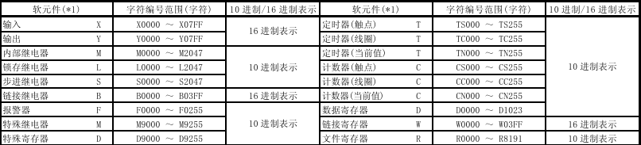

# Xcomm Melsec Module API Documentation

## Introduction
This module mainly implements the 1C, 1E, 3C, and 3E protocols from the Mitsubishi PLC Melsec protocol family, and is used for communication with Mitsubishi PLCs using the Melsec protocol.

## Features

* **Cross-platform**：The module is designed for cross-platform use, supporting various operating systems including Windows, Linux, macOS, iOS, Android, and HarmonyOS.

## Requirements

* **1C Protocol**：
  a. Configure the 'Format One' message for the 1C protocol in the PLC.
  b. Soft component address range, as shown in the figure below:
  

* **1E Protocol**：
  N/A
* **3C Protocol**：
  N/A
* **3E Protocol**：
  N/A

## Module
```c
extern xcomm_melsec_1c_module_t xcomm_melsec_1c;
extern xcomm_melsec_1e_module_t xcomm_melsec_1e;
extern xcomm_melsec_3c_module_t xcomm_melsec_3c;
extern xcomm_melsec_3e_module_t xcomm_melsec_3e;
```

## Module Interfaces
```c
struct xcomm_melsec_1c_module_s {
    /**
     * @brief The name of the module.
     * 
     * A string used to identify this module. For example: "Xcomm Melsec 1C Module".
     */
    const char* restrict name;

    /**
     * @brief Closes an existing device connection.
     * 
     * Terminates the specified device connection and releases any associated resources.
     * 
     * @param device Pointer to the device connection object to be closed.
     */
    void (*close)(xcomm_melsec_device_t* device);

    /**
     * @brief Establishes a new device connection.
     * 
     * Initializes and opens a new device connection based on the provided serial configuration and station/plc numbers.
     * 
     * @param config Pointer to a configuration structure that specifies the parameters for the serial connection.
     * @param stn_no Station number string.
     * @param plc_no PLC number string.
     * @return Returns a pointer to the newly created device connection object on success, NULL on failure.
     */
    xcomm_melsec_device_t* (*dial)(xcomm_serial_config_t* config, const char* restrict stn_no, const char* restrict plc_no);

    /**
     * @brief Loads a boolean value from the specified address in the PLC.
     * 
     * Reads a boolean value from the specified address in the PLC into the destination variable.
     * 
     * @param device Pointer to the established device connection object.
     * @param addr Address in the PLC to read from.
     * @param dst Destination variable to store the boolean value.
     * @return Returns 0 on success, a negative number on failure.
     */
    int (*load_bool)(xcomm_melsec_device_t* device, const char* restrict addr, bool* dst);

    /**
     * @brief Loads a 16-bit integer value from the specified address in the PLC.
     * 
     * Reads a 16-bit integer value from the specified address in the PLC into the destination variable.
     * 
     * @param device Pointer to the established device connection object.
     * @param addr Address in the PLC to read from.
     * @param dst Destination variable to store the 16-bit integer value.
     * @return Returns 0 on success, a negative number on failure.
     */
    int (*load_int16)(xcomm_melsec_device_t* device, const char* restrict addr, int16_t* dst);

    /**
     * @brief Loads a 32-bit integer value from the specified address in the PLC.
     * 
     * Reads a 32-bit integer value from the specified address in the PLC into the destination variable.
     * 
     * @param device Pointer to the established device connection object.
     * @param addr Address in the PLC to read from.
     * @param dst Destination variable to store the 32-bit integer value.
     * @return Returns 0 on success, a negative number on failure.
     */
    int (*load_int32)(xcomm_melsec_device_t* device, const char* restrict addr, int32_t* dst);

    /**
     * @brief Loads a 64-bit integer value from the specified address in the PLC.
     * 
     * Reads a 64-bit integer value from the specified address in the PLC into the destination variable.
     * 
     * @param device Pointer to the established device connection object.
     * @param addr Address in the PLC to read from.
     * @param dst Destination variable to store the 64-bit integer value.
     * @return Returns 0 on success, a negative number on failure.
     */
    int (*load_int64)(xcomm_melsec_device_t* device, const char* restrict addr, int64_t* dst);

    /**
     * @brief Loads an unsigned 16-bit integer value from the specified address in the PLC.
     * 
     * Reads an unsigned 16-bit integer value from the specified address in the PLC into the destination variable.
     * 
     * @param device Pointer to the established device connection object.
     * @param addr Address in the PLC to read from.
     * @param dst Destination variable to store the unsigned 16-bit integer value.
     * @return Returns 0 on success, a negative number on failure.
     */
    int (*load_uint16)(xcomm_melsec_device_t* device, const char* restrict addr, uint16_t* dst);

    /**
     * @brief Loads an unsigned 32-bit integer value from the specified address in the PLC.
     * 
     * Reads an unsigned 32-bit integer value from the specified address in the PLC into the destination variable.
     * 
     * @param device Pointer to the established device connection object.
     * @param addr Address in the PLC to read from.
     * @param dst Destination variable to store the unsigned 32-bit integer value.
     * @return Returns 0 on success, a negative number on failure.
     */
    int (*load_uint32)(xcomm_melsec_device_t* device, const char* restrict addr, uint32_t* dst);

    /**
     * @brief Loads an unsigned 64-bit integer value from the specified address in the PLC.
     * 
     * Reads an unsigned 64-bit integer value from the specified address in the PLC into the destination variable.
     * 
     * @param device Pointer to the established device connection object.
     * @param addr Address in the PLC to read from.
     * @param dst Destination variable to store the unsigned 64-bit integer value.
     * @return Returns 0 on success, a negative number on failure.
     */
    int (*load_uint64)(xcomm_melsec_device_t* device, const char* restrict addr, uint64_t* dst);

    /**
     * @brief Loads a float value from the specified address in the PLC.
     * 
     * Reads a float value from the specified address in the PLC into the destination variable.
     * 
     * @param device Pointer to the established device connection object.
     * @param addr Address in the PLC to read from.
     * @param dst Destination variable to store the float value.
     * @return Returns 0 on success, a negative number on failure.
     */
    int (*load_float)(xcomm_melsec_device_t* device, const char* restrict addr, float* dst);

    /**
     * @brief Loads a double value from the specified address in the PLC.
     * 
     * Reads a double value from the specified address in the PLC into the destination variable.
     * 
     * @param device Pointer to the established device connection object.
     * @param addr Address in the PLC to read from.
     * @param dst Destination variable to store the double value.
     * @return Returns 0 on success, a negative number on failure.
     */
    int (*load_double)(xcomm_melsec_device_t* device, const char* restrict addr, double* dst);

    /**
     * @brief Loads a string from the specified address in the PLC.
     * 
     * Reads a string from the specified address in the PLC into the destination buffer.
     * 
     * @param device Pointer to the established device connection object.
     * @param addr Address in the PLC to read from.
     * @param dst Destination buffer to store the string.
     * @param dlen Maximum length of the destination buffer.
     * @return Returns the actual number of bytes read on success, a negative number on failure.
     */
    int (*load_string)(xcomm_melsec_device_t* device, const char* restrict addr, char* dst, uint64_t dlen);

    /**
     * @brief Stores a boolean value to the specified address in the PLC.
     * 
     * Writes a boolean value to the specified address in the PLC.
     * 
     * @param device Pointer to the established device connection object.
     * @param addr Address in the PLC to write to.
     * @param src Source boolean value to write.
     * @return Returns 0 on success, a negative number on failure.
     */
    int (*store_bool)(xcomm_melsec_device_t* device, const char* restrict addr, bool src);

    /**
     * @brief Stores a 16-bit integer value to the specified address in the PLC.
     * 
     * Writes a 16-bit integer value to the specified address in the PLC.
     * 
     * @param device Pointer to the established device connection object.
     * @param addr Address in the PLC to write to.
     * @param src Source 16-bit integer value to write.
     * @return Returns 0 on success, a negative number on failure.
     */
    int (*store_int16)(xcomm_melsec_device_t* device, const char* restrict addr, int16_t src);

    /**
     * @brief Stores a 32-bit integer value to the specified address in the PLC.
     * 
     * Writes a 32-bit integer value to the specified address in the PLC.
     * 
     * @param device Pointer to the established device connection object.
     * @param addr Address in the PLC to write to.
     * @param src Source 32-bit integer value to write.
     * @return Returns 0 on success, a negative number on failure.
     */
    int (*store_int32)(xcomm_melsec_device_t* device, const char* restrict addr, int32_t src);

    /**
     * @brief Stores a 64-bit integer value to the specified address in the PLC.
     * 
     * Writes a 64-bit integer value to the specified address in the PLC.
     * 
     * @param device Pointer to the established device connection object.
     * @param addr Address in the PLC to write to.
     * @param src Source 64-bit integer value to write.
     * @return Returns 0 on success, a negative number on failure.
     */
    int (*store_int64)(xcomm_melsec_device_t* device, const char* restrict addr, int64_t src);

    /**
     * @brief Stores an unsigned 16-bit integer value to the specified address in the PLC.
     * 
     * Writes an unsigned 16-bit integer value to the specified address in the PLC.
     * 
     * @param device Pointer to the established device connection object.
     * @param addr Address in the PLC to write to.
     * @param src Source unsigned 16-bit integer value to write.
     * @return Returns 0 on success, a negative number on failure.
     */
    int (*store_uint16)(xcomm_melsec_device_t* device, const char* restrict addr, uint16_t src);

    /**
     * @brief Stores an unsigned 32-bit integer value to the specified address in the PLC.
     * 
     * Writes an unsigned 32-bit integer value to the specified address in the PLC.
     * 
     * @param device Pointer to the established device connection object.
     * @param addr Address in the PLC to write to.
     * @param src Source unsigned 32-bit integer value to write.
     * @return Returns 0 on success, a negative number on failure.
     */
    int (*store_uint32)(xcomm_melsec_device_t* device, const char* restrict addr, uint32_t src);

    /**
     * @brief Stores an unsigned 64-bit integer value to the specified address in the PLC.
     * 
     * Writes an unsigned 64-bit integer value to the specified address in the PLC.
     * 
     * @param device Pointer to the established device connection object.
     * @param addr Address in the PLC to write to.
     * @param src Source unsigned 64-bit integer value to write.
     * @return Returns 0 on success, a negative number on failure.
     */
    int (*store_uint64)(xcomm_melsec_device_t* device, const char* restrict addr, uint64_t src);

    /**
     * @brief Stores a float value to the specified address in the PLC device.
     *
     * Writes a floating-point value to the specified address in the Mitsubishi PLC using the Melsec protocol.
     *
     * @param device Pointer to the Melsec device object.
     * @param addr The soft component address where the value will be stored.
     * @param src The floating-point value to store.
     * @return Returns 0 on success, or a negative value on failure.
     */
    int (*store_float)(xcomm_melsec_device_t* device, const char* restrict addr, float src);

    /**
     * @brief Stores a double value to the specified address in the PLC device.
     *
     * Writes a double-precision floating-point value to the specified address in the Mitsubishi PLC using the Melsec protocol.
     *
     * @param device Pointer to the Melsec device object.
     * @param addr The soft component address where the value will be stored.
     * @param src The double-precision floating-point value to store.
     * @return Returns 0 on success, or a negative value on failure.
     */
    int (*store_double)(xcomm_melsec_device_t* device, const char* restrict addr, double src);

    /**
     * @brief Stores a string to the specified address in the PLC device.
     *
     * Writes a string to the specified address in the Mitsubishi PLC using the Melsec protocol. The string is written starting at the given address and continues for 'slen' bytes.
     *
     * @param device Pointer to the Melsec device object.
     * @param addr The soft component address where the string will start being stored.
     * @param src The string to store.
     * @param slen The number of bytes from the source string to write.
     * @return Returns 0 on success, or a negative value on failure.
     */
    int (*store_string)(xcomm_melsec_device_t* device, const char* restrict addr, char* src, int slen);
```

## Example Code
```c
#include <stdio.h>
#include <stdlib.h>
#include <string.h>
#include <assert.h>
#include "xcomm.h"

int main(void) {
    xcomm_dumper_config_t dumper_config = {
        .filename = NULL, 
        .mode     = XCOMM_DUMPER_MODE_FILE,
        .level    = XCOMM_DUMPER_LEVEL_DEBUG
    };
    xcomm_dumper.init(&dumper_config);

    xcomm_serial_config_t config = {
        .device   = "COM2",
        .baudrate = XCOMM_SERIAL_BAUDRATE_9600,
        .parity   = XCOMM_SERIAL_PARITY_NO,
        .databits = XCOMM_SERIAL_DATABITS_CS8,
        .stopbits = XCOMM_SERIAL_STOPBITS_ONE,
        .timeout_ms = 0,
    };
    xcomm_melsec_device_t* device = 
        xcomm_melsec_1c.dial(&config, NULL, NULL);

    char wstr[5] = "12AB";
    xcomm_melsec_1c.store_string(device, "D0000", wstr, sizeof(wstr));

    char rstr[5];
    xcomm_melsec_1c.load_string(device, "D0000", rstr, sizeof(rstr));
    assert(strcmp(rstr, wstr) == 0);

    xcomm_melsec_1c.close(device);
    return 0;
}
```